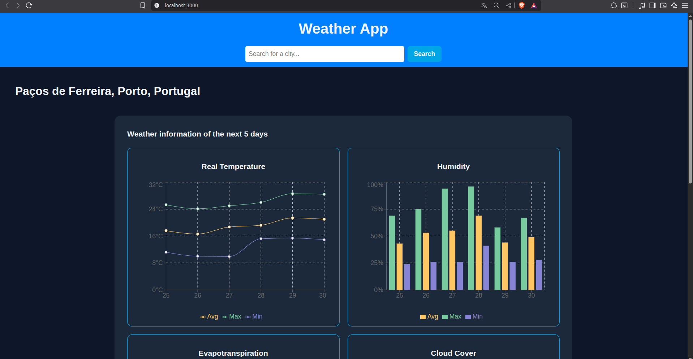

# Weather App

A modern full-stack web application that displays weather data for your current location and any city you search for.  
Frontend built with **React**, **Vite**, **TailwindCSS**, and **Recharts**. Backend powered by **Express.js** and **Node.js**. Data provided by the [Tomorrow.io Weather API](https://www.tomorrow.io/weather-api/).

## 🚀 Live Demo

👉 [View the app on Vercel](https://weather-app-henna-two-41.vercel.app/)

## ✨ Features

- 🌍 **Current Location Weather:** Automatically detects and displays your local weather.
- 🔎 **City Search:** Get weather data for any city worldwide.
- 📊 **Interactive Charts:** Visualize temperature, humidity, wind speed, cloud cover, UV index, and more for the next 5 days.
- ⚡ **Fast & Responsive:** Optimized for mobile, tablet, and desktop.
- 🗄️ **Secure Backend API:** Express.js server handles API requests and protects the Tomorrow.io key.

## 📷 Screenshots



## 🛠 Tech Stack

- **Frontend:** [React](https://react.dev/), [Vite](https://vitejs.dev/), [TailwindCSS](https://tailwindcss.com/), [Recharts](https://recharts.org/)
- **Backend:** [Express.js](https://expressjs.com/), [Node.js](https://nodejs.org/)
- **API:** [Tomorrow.io Weather API](https://www.tomorrow.io/weather-api/)

## 🧑‍💻 Getting Started

### Creating .env file

- Create a `.env` file and add your [Tomorrow.io API key](https://app.tomorrow.io/development/keys):
    ```
    TOMORROW_API_KEY=your_api_key_here
    ```

### Option 1: Local Setup (Node.js & npm)

#### Prerequisites

- [Node.js](https://nodejs.org/) (v22+ recommended)
- [npm](https://www.npmjs.com/)

#### 1. Clone the Repository

```sh
git clone https://github.com/miguelPRG/WeatherApp.git
cd WeatherApp
```

#### 2. Setup the Backend

1. Go to the backend folder:
    ```sh
    cd backend
    ```
2. Install dependencies:
    ```sh
    npm install
    ```
3. Start the backend server:
    ```sh
    npm run server
    ```
    The backend will run on [http://localhost:8000](http://localhost:8000)

#### 3. Setup the Frontend

1. Open a new terminal and go to the frontend folder:
    ```sh
    cd frontend
    ```
2. Install dependencies:
    ```sh
    npm install
    ```
3. Start the development server:
    ```sh
    npm run dev
    ```
    The frontend will run on [http://localhost:3000](http://localhost:3000)

### Option 2: Using Docker (Development Only)

#### 🐳 Docker (Development Only)

This project includes Docker configuration to simplify **development setup**.  
It allows you to run both frontend and backend in isolated containers without installing Node.js or npm locally for each part.  

> ⚠️ Note: Docker is configured **for development purposes only**, not for production deployment. For production, you would need to build the frontend and deploy containers to a server or a cloud service. This project runs in [Render](https://render.com/)(backend) and [Vercel](https://vercel.com/)(frontend)

#### 1. Start the App with Docker

From the project root, run:

```sh
docker-compose up --build
```
This will start:

. Backend on [http://localhost:8000](http://localhost:8000)
. Frontend on [http://localhost:3000](http://localhost:3000)

#### 2. Stop the Containers

```sh
docker-compose down
```

## Usage

- On load, the app requests your location and shows weather data automatically.
- Search for any city to get its forecast.
- Data is cached in local storage to reduce API calls.
- Explore charts for temperature, humidity, wind speed, cloud cover, evapotranspiration, and UV index.

## Project Structure

```
backend/
    app.js
    package.json
    Dockerfile
    .dockerignore
    .env
frontend/
    src/
        components/
        hooks/
        styles/
        App.tsx
        main.tsx
    public/
    package.json
    vite.config.ts
    Dockerfile
    .dockerignore
docker-compose.yml
```

## License

This project is for portfolio and educational purposes.

---

Made by [Miguel Gonçalves](https://www.linkedin.com/in/miguel-gon%C3%A7alves-087195169/)
